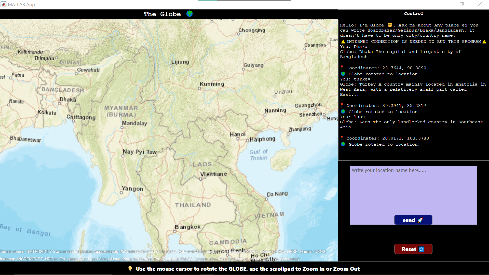

# SmartGlobe - MATLAB GUI Project
**Course:** EEE 4416 - Simulation Lab in MATLAB  
**Semester:** [4th] (*summer of 2025*)

---

## 📌 Project Overview
SmartGlobe is an interactive GUI-based application that integrates a 3D globe with AI-powered conversational ability.  
The aim was to allow users to click any location on the globe, extract latitude/longitude, and query an AI model (DeepSeek via OpenRouter) about that place (tourism, history, culture, food, etc.).




---

## 🎯 Initial Plan
- Display an interactive 3D globe inside MATLAB.
- Allow users to click on any location → extract **Latitude & Longitude**.
- Send this location data to **DeepSeek API** via OpenRouter.
- Receive and display a conversational response about the selected location.

---

## ⚠️ Limitations
1. MATLAB App Designer **does not support globe interaction** (`geoaxes`, `geoglobe`, `inputgeo` not functional).
2. Embedding **Cesium ESM JS globe** inside MATLAB App failed (`uihtml` too limited).
3. API restrictions:
   - **OpenRouter (DeepSeek, Gemini)** → blocked by MATLAB administration (token requests not allowed).
   - **Direct API calls** (DuckDuckGo, OpenStreetMap) from MATLAB → restricted.

---

## ✅ Resolution / Workaround
- Instead of user input via globe clicks, the **globe is used only for displaying output**.
- Place queries are given manually (through text input).
- **DuckDuckGo API** → retrieves short descriptions of places.
- **OpenStreetMap Nominatim API** → fetches latitude & longitude of a location to reposition the globe camera.

---

## ⚙️ CMD Integration (Using `curl`)
Since MATLAB cannot fetch APIs directly in App Designer, `curl` is used in the CMD to fetch JSON responses.

### 🔹 Example: DuckDuckGo API (get description)
```bash
curl -X GET "https://api.duckduckgo.com/?q=Dhaka&format=json" -o output.json
curl -X GET "https://nominatim.openstreetmap.org/search?q=Dhaka&format=json&limit=1" -o coords.json
```

